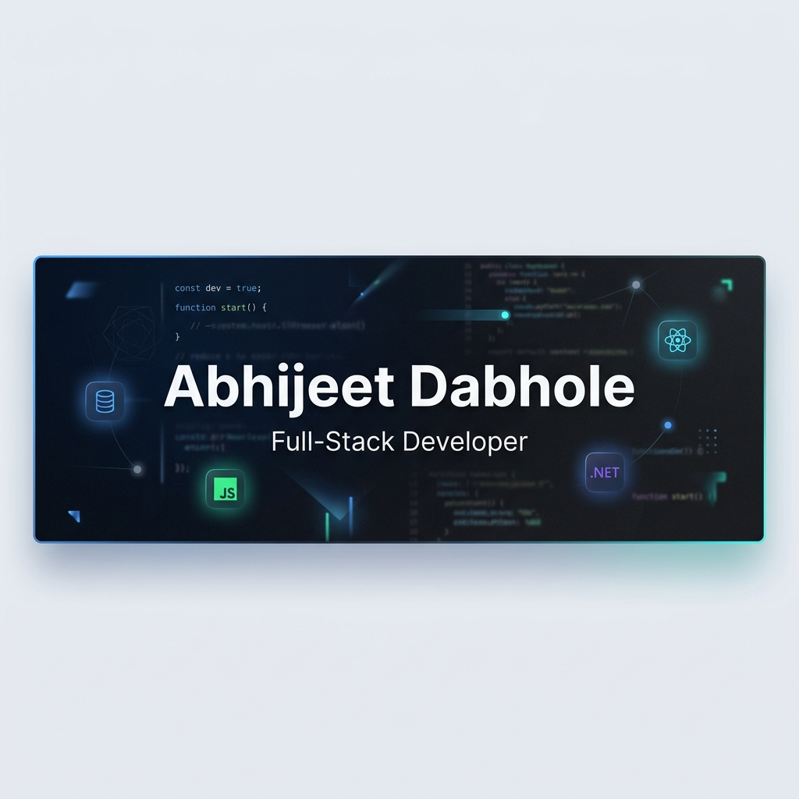

<div align="center">

  

  <br/>
  <br/>

  <!-- Animated Typing SVG -->
  <a href="https://git.io/typing-svg">
    
  </a>

</div>

---

## 👋 About Me

```javascript
const abhijeet = {
    name: "Abhijeet Dabhole",
    role: "Full-Stack Developer",
    languages: ["JavaScript", "C#", "SQL", "HTML", "CSS", "Python"],
    frontend: ["Angular", "React.js", "HTML5", "CSS3"],
    backend: ["ASP.NET Core", "ASP.NET MVC", "ASP.NET Web API", ".NET Framework 4.8"],
    database: ["SQL Server"],
    tools: ["Git", "GitHub", "REST APIs", "AI", "Claude", "ChatGPT", "Antigravity Gemini"],
    currentFocus: "Building scalable full-stack web applications",
    funFact: "I turn coffee into code ☕ → 💻"
};
```

- 🔭 I'm currently working on **exciting full-stack projects**
- 🌱 I'm constantly learning **new frameworks and design patterns**
- 💬 Ask me about **React, .NET, SQL Server, or Web APIs**
- ⚡ Fun fact: I love building things that make people's lives easier

---

## 🛠️ Tech Stack

<div align="center">

### 💻 Languages


### ⚛️ Frontend


### ⚙️ Backend


### 🗄️ Database & Tools


### 🤖 AI & LLMs


</div>

---

## 📊 GitHub Stats

<div align="center">

  
  &nbsp;&nbsp;
  

  <br/>
  <br/>

  <!-- GitHub Streak -->
  

</div>

---

## 🏆 GitHub Trophies

<div align="center">
  
</div>

---

## 🐍 Contribution Graph

<div align="center">
  <picture>
    <source media="(prefers-color-scheme: dark)" srcset="https://raw.githubusercontent.com/abhidabhole/abhidabhole/output/github-snake-dark.svg" />
    <source media="(prefers-color-scheme: light)" srcset="https://raw.githubusercontent.com/abhidabhole/abhidabhole/output/github-snake.svg" />
    
  </picture>
</div>

---

## 📫 Let's Connect

<div align="center">

[](https://github.com/abhidabhole)
<!-- Uncomment and fill these when you have the accounts:
[](https://linkedin.com/in/YOUR_LINKEDIN)
[](https://twitter.com/YOUR_TWITTER)
[](https://YOUR_PORTFOLIO_URL)
-->

</div>

---

<div align="center">

  

  <br/>
  <br/>

  **💡 _"First, solve the problem. Then, write the code."_ — John Johnson**

  <br/>

  ⭐ **If you find my work useful, consider giving a star!** ⭐

</div>
